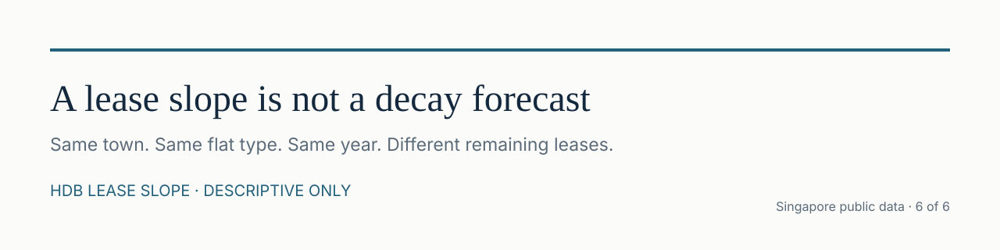
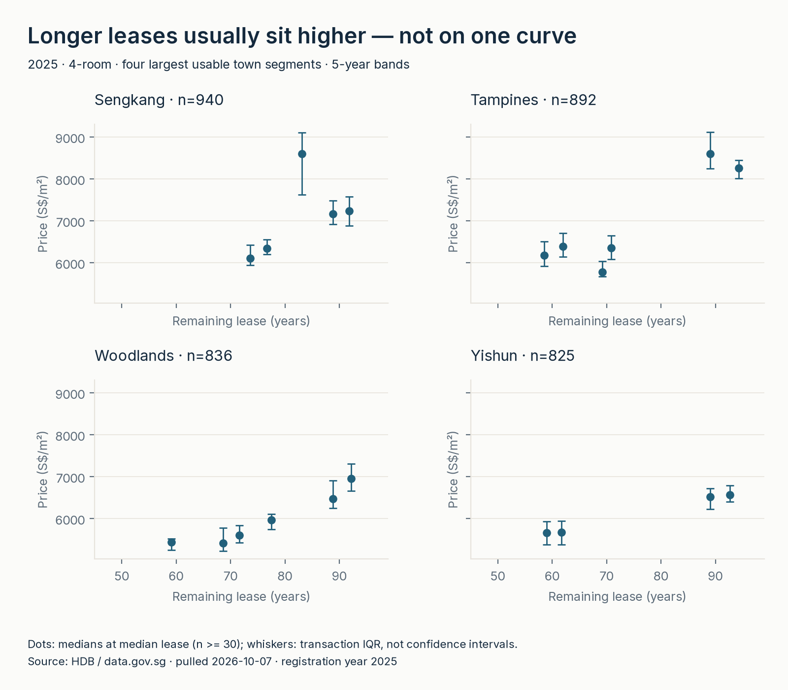
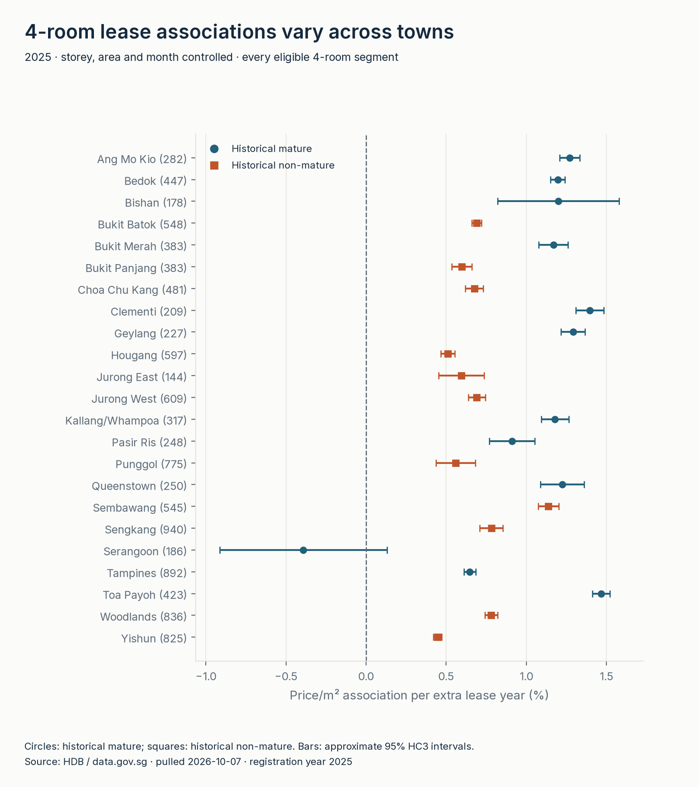
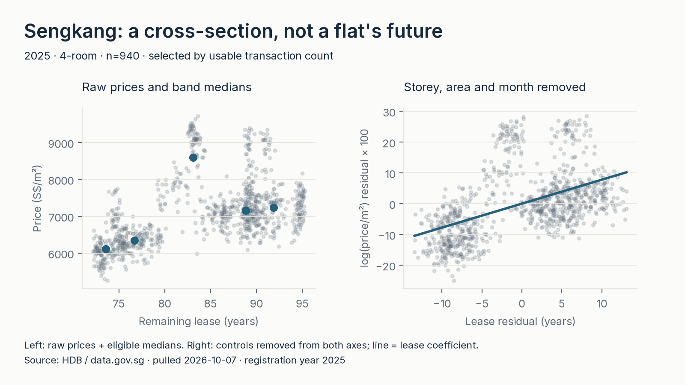

<picture>
  <source media="(prefers-color-scheme: dark)" srcset="assets/banner-dark.svg">
  
</picture>

[Full-size banner](assets/banner.svg) · [dark](assets/banner-dark.svg).

# hdb-lease-slope

[](https://github.com/faizsaifulnizam/hdb-lease-slope/actions/workflows/ci.yml)   

> **Longer leases are usually associated with higher price/m², but not on one common curve.** In 2025, the median controlled association per extra lease year is **+1.20%** across eligible historical mature-town segments versus **+0.69%** across historical non-mature segments. Restricting both groups to 4-room flats gives **+1.20% versus +0.67%**. These cross-sectional associations are **not an individual flat's annual depreciation rate**.

Built and reviewed 2026-10-04; official dataset refreshed and refit 2026-10-07. Public repo; GitHub Pages is on. Full refit was checked on my machine; a stranger replay must pass `src/verify.py` (see the float tolerance below). Part of a six-repo series on Singapore's public data. [Report site](https://faizsaifulnizam.github.io/hdb-lease-slope/) · [verification scope](docs/verification.md).

**Intended use:** For a housing-market analyst, this brief supports interpreting observed lease associations within town and flat-type segments, with their support and uncertainty kept visible. It is not a comparable-selection or valuation tool, and the slopes do not measure an individual flat’s depreciation or value.

## Key numbers (all reproducible)

- **2025:** 25,084 valid transactions / 129 town × flat-type cells. 62 eligible models use 22,048 transactions; 67 cells are withheld. 61 of 62 reported coefficients are positive, not necessarily individually distinguishable from zero.
- **All types, historical groups:** 29 mature cells, median +1.198%, range **−0.392% to +1.749%**; 33 non-mature cells, median +0.689%, range **+0.070% to +1.406%** per extra lease year. Unweighted segment distributions, not a national pooled estimate.
- **4-room:** 12 mature towns, median +1.197%; 11 non-mature towns, median +0.675%. Type composition does not alone explain the median ordering, but location/vintage/support still differ.
- **Primary bands:** 235 of 639 five-year cells meet n≥30; 404 thin bands / 4,318 transactions are suppressed only from display. Raw ledger: **242,031 retained + 1 inconsistent lease = 242,032 records**, January 2017–partial October 2026.

<picture>
  <source media="(prefers-color-scheme: dark)" srcset="reports/figures/f1_buckets-dark.png">
  
</picture>

[Full-size light](reports/figures/f1_buckets.png) · [dark](reports/figures/f1_buckets-dark.png).

*Primary comparison: same town × flat type × year. Bands are [0,5), [5,10), … lease years; dots sit at each band's median remaining lease, and whiskers show transaction IQR—not confidence intervals. Panel n is all valid 2025 sales in that town × 4-room cell, including bands hidden for n<30. It is not the town total. Missing bands are not connected across gaps.*

### More views

<picture>
  <source media="(prefers-color-scheme: dark)" srcset="reports/figures/f2_slopes-dark.png">
  
</picture>

[Full-size light](reports/figures/f2_slopes.png) · [dark](reports/figures/f2_slopes-dark.png).

*All eligible 4-room towns, alphabetically ordered; parentheses give transaction n. Shapes distinguish historical groups; approximate 95% HC3 intervals are not causal uncertainty.*

<picture>
  <source media="(prefers-color-scheme: dark)" srcset="reports/figures/f3_exemplar-dark.png">
  
</picture>

[Full-size light](reports/figures/f3_exemplar.png) · [dark](reports/figures/f3_exemplar-dark.png).

*Largest usable 4-room cell: Sengkang (n=940). Controlled association +0.782% per extra lease year, approximate interval +0.710% to +0.854%, over 72.17–95.25 remaining years. The line fits residual log price, not a predicted flat price.*

## The question

Holding town and flat type fixed, how does price/m² vary with remaining lease—and does the association differ between the historical groups? The binned view shows local bends; the regression summarizes controlled associations. Neither follows the same flat through time. This is not a price estimator.

## The data

[Official HDB resale registrations, January 2017 onwards](https://data.gov.sg/datasets/d_8b84c4ee58e3cfc0ece0d773c8ca6abc/view), ID `d_8b84c4ee58e3cfc0ece0d773c8ca6abc`. Independent downloader; no sibling repo's processed data. Live 2026-10-07 pull: 242,032 records / 118 months. [Byte receipt](outputs/source_snapshot.json) and [audit](docs/data_audit.md) carry SHA-256, fields, coverage, nulls and repeat-looking-row counts.

The refresh adds 114 October 2026 rows and removes two earlier rows (one July, one August), a net increase of 112. Exact-row multiset comparison finds no 2025 additions or removals; all baseline coefficients and 28 sensitivity summaries were refit and remain unchanged.

HDB already excludes transactions that may not reflect full market price, including some relatives/part-share transfers. Area includes recess/upgrading/terrace space. The file lacks unique unit/transaction IDs. Only the 2017-onward file is used; this is scope, not a claim that no earlier file recorded remaining lease.

## Method

1. **Validate and preserve provenance.** Check CSV shape/history before replacing raw and manifest. A cache must match its existing byte hash. DuckDB stages strings using `TRY_*`, derives `price/area` and storey midpoint, and assigns one exclusive exclusion reason. **Retain repeat-looking transactions:** no invented unique key or silent deduplication.
2. **Parse with honest precision.** `61 years 04 months` → 736 months; `62 years 01 month` → 745; `60 years` → 720. Require valid components and 1–1,188 months. January-start expected months = `12*(commence_year+99-sale_year)-(sale_month-1)`. Retain reported-minus-expected offsets **−12 through +18 months**: commencement month is unknown, years-only precision coarse, and reference-date/rounding slack allowed. Extra slack is an analyst QC screen, not an official maximum lag. One −179-month mismatch is excluded, not corrected or proven erroneous. Strict 0–12 sensitivity is exported.
3. **Primary medians within one year.** Latest completed past calendar year with all 12 registration months = **2025**, not partial 2026. Five-year lease-band medians/IQR within **town × type × year**; display n≥30. Four examples are the largest eligible 4-room models with at least three usable bands (alphabetical tie-break): Sengkang, Tampines, Woodlands, Yishun. Selection is by count/support, not outcome. Suppressed bands remain in staging and can enter eligible models.
4. **Secondary models separately by town × type, 2025.** OLS: `log(price/m²) = intercept + beta*lease_years + storey_midpoint + floor_area_sqm + registration_month_indicators + error`. Center continuous predictors; one dummy per observed month except earliest reference. All 12 months give **15 parameters**, not a numeric month trend. Require n≥100, ≥10-year lease span, ≥6 months, full rank, residual df≥30, ≥0.5 residual lease years after controls, scaled condition≤1e8 and no unit leverage. Withheld coefficients are blank, not zero.
5. **Identification and uncertainty.** Lease combines vintage and sale time. Month effects remove time-level differences; β uses residual **between-flat/vintage** variation—not aging of one flat. Block/vintage fixed effects would largely absorb it; no age-period-cohort causal identification claimed. Residual lease SD is 1.74–16.53 years across reported models; support/diagnostics stay in [slopes.csv](outputs/slopes.csv). HC3 uses squared residuals adjusted by leverage; intervals are `beta ± 1.96*SE`, a normal approximation, transformed with **`100*(exp(beta)-1)`**. These are not exact, simultaneous, clustered or prediction intervals. HC3 does **not** account for shared-block dependence; intervals may be too narrow.
6. **Historical groups, not current labels.** [HDB's 20 August 2023 Annex A](https://www.hdb.gov.sg/-/media/hdb-pulse/news/2023/new-plus-housing-model-with-more-subsidies/Annex-A1.pdf) lists 15 mature and 12 non-mature towns/estates. [Lookup](outputs/town_groups.csv) maps `Kallang/ Whampoa` to `KALLANG/WHAMPOA`; no planning-area inference. Tengah is non-mature on Annex A and is in the lookup. This resale file has no Tengah rows, so no slope is estimated. [Standard/Plus/Prime](https://www.hdb.gov.sg/about-us/news-and-publications/press-releases/New-Flat-Classification-Framework) applies at project/location level from October 2024, not a current mature-town map. Compare **unweighted eligible-segment medians/ranges**, plus 4-room because type composition differs. No group p-value or universal group effect.

### Rules chosen, and why

| Rule | Why / ceiling |
|---|---|
| One complete year | Keep cross-year inflation out of a lease comparison; older annual cells are context exports |
| Five-year bands; n≥30 | Reduce noise while exposing missing support; no outcome trimming |
| Model n≥100, span≥10 years | Withhold thin/narrow fits; never extrapolate a full-lease curve |
| Equal weight per published transaction in OLS | No unit ID to reconstruct a panel |
| Unweighted median across segments | Large towns do not dominate; not a transaction-weighted national effect |
| No block-age control or causal claim | Vintage is tied to lease and omitted local attributes |

### Validation — receipts, not claims

- [Raw ledger](outputs/exclusions.csv): **242,031 + 1 = 242,032**. [Annual model ledger](outputs/model_exclusions.csv): **22,048 estimated + 2,576 small-n + 460 narrow-support = 25,084**.
- [Bucket receipt](outputs/bucket_sensitivity.csv): **20,766 + 4,318 = 25,084**; suppression is not another raw exclusion.
- Independent stdlib raw medians: Sengkang 70–<75 **152 / S$6,112.86/m²**; Tampines 55–<60 **211 / S$6,179.89**; Yishun 55–<60 **175 / S$5,659.34**.
- Runnable parser/invalid/tolerance tests; exact beta/HC3 math; thin/rank cells and month-only collinearity. **Synthetic data are tests only**, never analysis inputs.
- CI checks committed receipts and focused offline tests, plus a separate **Linux live-download/full-refit job that runs `src/verify.py`**. It requires the reviewed source SHA-256; an official revision fails with an explicit snapshot-review message. Raw stays ignored. Cross-OS CSV/PNG byte equality is not required.
- Figures enforce ≥40px text margins, clipping/overlap checks and partial-regression identity. Original six-theme visual review was on 2026-10-04; refreshed renders pass executable QA and repeat hashes, but fresh visual inspection is pending because the image-analysis service was unavailable. [Verification scope](docs/verification.md).

### Limits — what this file cannot say

Town/type/month controls do not remove micro-location, block vintage, flat model, condition/renovation, buyer characteristics or selective resale. This is observed resale transactions, not every flat or a unit panel. Medians are not forced monotonic: Sengkang's 80–<85-year band sits above its 90–<95 band. One log-linear coefficient cannot represent every local bend. Group supports differ and ranges overlap. Historical maturity is not itself an explanation.

**Do not multiply these slopes by years to forecast a flat's future price.** No causal decay rate, current-classification premium, loan/policy effect or individual value can be established. [Sensitivity](docs/sensitivity.md) covers n=50/100/200, support=5/10/15 years, 2024, 4-room and strict lease screening; this does not repair omitted-variable bias. [Decision memo](docs/decision_memo.md).

## Reproduce

Python **3.12.10**, DuckDB 1.5.6, NumPy 2.5.3, matplotlib 3.11.2; bundled series fonts. From repo root:

```bash
uv venv --python 3.12.10
if [ -f .venv/Scripts/activate ]; then
  source .venv/Scripts/activate
else
  source .venv/bin/activate
fi
uv pip install -r requirements.txt
python src/download.py
python src/build_dataset.py
python src/analysis.py
python src/figures.py
python -m unittest discover -s tests -p 'test_*.py' -v
python tests/smoke_test.py
python src/verify.py
# Local dependency-backed figure mirror/rollback check (not the offline CI suite):
python tests/check_figure_publish.py
```

If `uv` is missing: `pip install uv`. Then rerun from `uv venv`.

Spot-check: `group_summaries.csv` 2025 all-types medians **1.1984156885 / 0.6892626164** and 4-room **1.1967679273 / 0.6745169870**, absolute tolerance **1e-9**. The reviewer reported a Linux refit of the same SHA-256 moving 1.198415688496771 to 1.1984156884967616: floating-point/linear-algebra roundoff, not a new HDB file. Same-environment CSV and PNG bytes matched the reviewed build; cross-OS PNG bytes can differ, and OLS text can differ in the last digits. Sengkang 70–<75: **n=152 / S$6,112.86/m²**.

Snapshot-specific numbers: the official live file can be revised. A changed hash means fresh analysis, not identity with the old snapshot. `--force` explicitly refreshes; altered cache fails. Single DuckDB thread/fixed row ordering. Same-environment CSV/PNG equality is verified; cross-OS pixel identity is not. The ignored raw manifest records each actual pull time. If bytes and source metadata are unchanged, the committed snapshot receipt preserves its reviewed retrieval time; changed inputs receive a new receipt. Byte hash/rows/coverage anchor the input. Producer batches roll back ordinary swaps, not power loss/process kill across the entire pipeline. One writer required.

## Caveats

Lease precision varies; the 99-year screen can exclude atypical leases as well as source mistakes. HC3 omits block dependence and confounding. No significance ranking, forecast or causal claim. Fixed 2023 groups are historical only.

## Out of scope

Estimator/API, individual-flat forecast, location/condition enrichment, causal policy claims. [Published report](https://faizsaifulnizam.github.io/hdb-lease-slope/). The manual GitHub social-preview upload remains separate; no source-only release is needed.

## Licence

Code: [MIT](LICENSE). Data: [Singapore Open Data Licence](https://data.gov.sg/open-data-licence), © HDB. Independent, unofficial analysis. Bundled fonts carry SIL OFL licences in `assets/fonts/`.

---

*Six-on-SG: six Singapore-data analyses plus one AI workflow — seven repos.* [01 · hdb-resale-mart](https://github.com/faizsaifulnizam/hdb-resale-mart) · [02 · card-book-quality](https://github.com/faizsaifulnizam/card-book-quality) · [03 · coe-quota-premium](https://github.com/faizsaifulnizam/coe-quota-premium) · [04 · retail-sales-split](https://github.com/faizsaifulnizam/retail-sales-split) · [05 · coe-category-break](https://github.com/faizsaifulnizam/coe-category-break) · [06 · hdb-lease-slope](https://github.com/faizsaifulnizam/hdb-lease-slope) · [07 · ai-analyst-workflow](https://github.com/faizsaifulnizam/ai-analyst-workflow) (the AI-workflow add).

*If you found this useful, a star helps others find it.*
